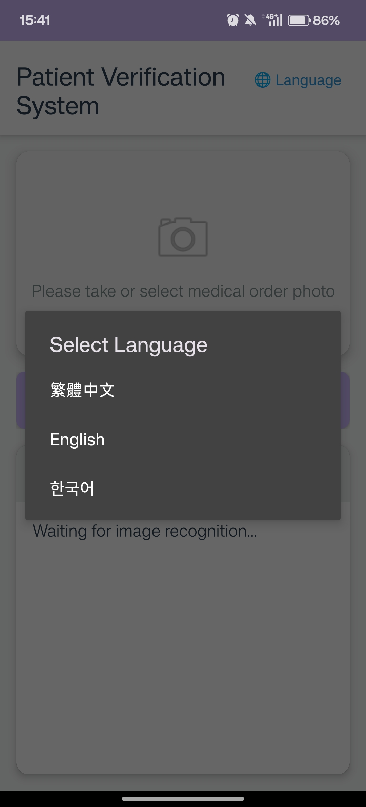
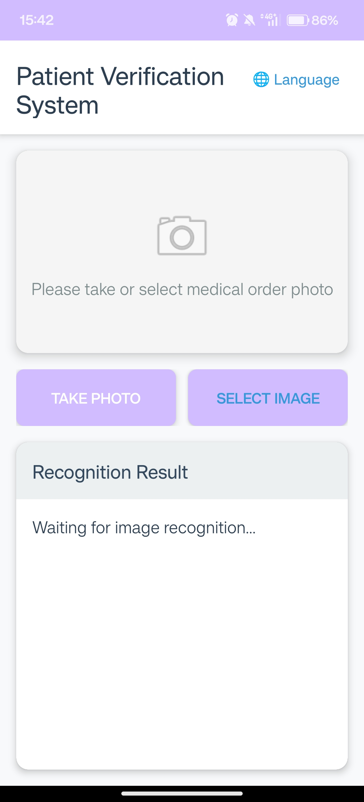
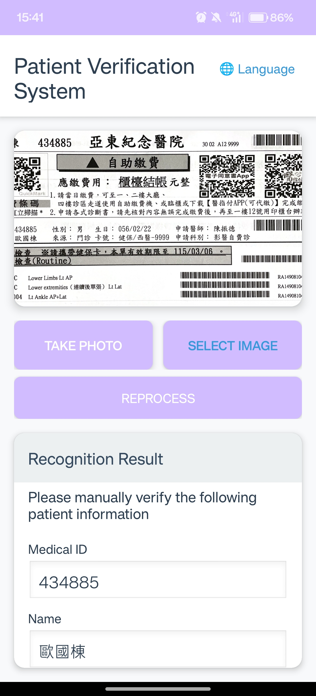

# Generative AI Voice Identity Recognition System for Medical Institutions

> - 🥇 **Gold Medal** — 2025 Kaohsiung International Invention and Design EXPO (*KIDE 2025*)
> - 🥉 **Bronze Prize** — 2025 Seoul International Invention Fair (*SIIF 2025*)

---

## 📝 Abstract

Patient identity verification in clinical settings is critical for medical safety, yet traditional manual processes can be cumbersome and prone to human error. Developed in collaboration with the **Department of Healthcare Administration at Asia Eastern University of Science and Technology (AEUST)** , this project introduces a native Android application designed to streamline patient verification and enhance clinical efficiency.

The system utilizes **Google ML Kit Optical Character Recognition (OCR)** to automatically capture essential patient information — such as medical record numbers, names, dates of birth, and examination items—directly from physical medical order slips. Integrated with the **OpenAI API**, the application features a multilingual, interactive generative AI voice module that guides patients through verbal identity checks and pre-examination confirmations. This **dual-verification mechanism** significantly improves verification accuracy while offering an accessible, barrier-free healthcare experience for visually impaired or low-literacy patients.

## 🛠️ Technology Stack

| Technology | Description |
|---|---|
| **Kotlin** | Native Android Application Development |
| **Google ML Kit** | On-device Text Recognition (OCR) |
| **OpenAI API** | Generative AI Voice & Dialog Processing |
| **Android Studio** | Development Environment |

## 📱 User Interface & Workflow

<table>
  <thead>
    <tr>
      <th align="center" width="33%">1. Language Selection</th>
      <th align="center" width="33%">2. Medical Order OCR</th>
      <th align="center" width="33%">3. Voice Validation</th>
    </tr>
  </thead>
  <tbody>
    <tr>
      <td align="center">
        
      </td>
      <td align="center">
        
      </td>
      <td align="center">
        
      </td>
    </tr>
  </tbody>
</table>

## 🎬 System Demo

> Demonstration of the system workflow and key functionalities.

